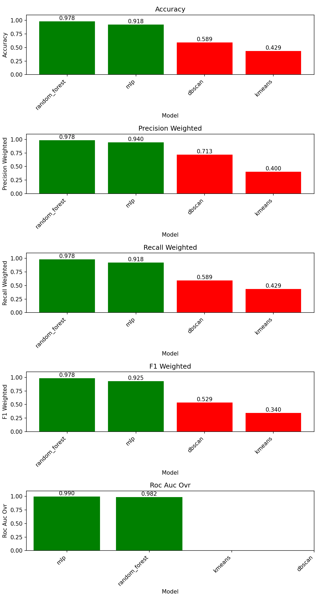
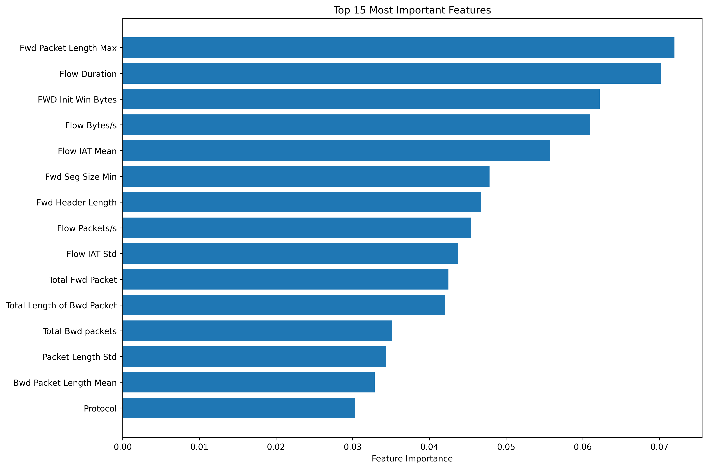

## Auris AI - Network Anomaly Detection

Detect unusual or potentially malicious network activity by distinguishing normal behaviour from anomalies using a mix of supervised, unsupervised, and deep learning models.


Live site: [auris-network-anomaly-detection-ai.vercel.app](https://auris-network-anomaly-detection-ai.vercel.app/)


## Quick Start

### Backend

```bash
cd Backend
python -m venv .venv
.\.venv\Scripts\activate
pip install -r requirements.txt

# Preprocess data (creates processed_data.npz and feature_metadata.pkl)
python data_preprocessing\data_cleaning.py

# Train and evaluate models (caches to Backend/cache/models)
python main.py

# Start API server
uvicorn serve:app --host 127.0.0.1 --port 8000 --reload
```
Backend SwaggerUI: `http://127.0.0.1:8000/docs`.

### Frontend

```bash
cd frontend
npm install
npm start
```
Front end URL: `http://127.0.0.1:3000`.
The frontend expects the backend at `http://127.0.0.1:8000`.


## Backend development:
Details: `https://github.com/Schnitze1/COS30049-Computing-Technology-Innovation-Project`

### Feature Correlation Selection


### Model Performance Comparison


### Feature Importance Analysis



## Architecture


**Components:**
- **Frontend (React, `frontend/`)**: Web App for exploration, model selection, and visualisation (probabilities, confusion matrices, clustering views). Talks to the backend via REST.
- **Backend (Python/FastAPI, `Backend/`)**: Data preprocessing, training, model registry, and prediction API. Trained artefacts cached in `Backend/cache/models` and loaded at serve time.
- **Data pipeline (`Backend/data_preprocessing/`)**: Cleans https://ieeexplore.ieee.org/document/10262330 dataset, engineers features, balances classes, and persists `processed_data.npz` plus `feature_metadata.pkl`.
- **Serving (`Backend/serve.py`)**: Exposes endpoints (e.g., `/predict`) that the frontend calls during interactive testing.